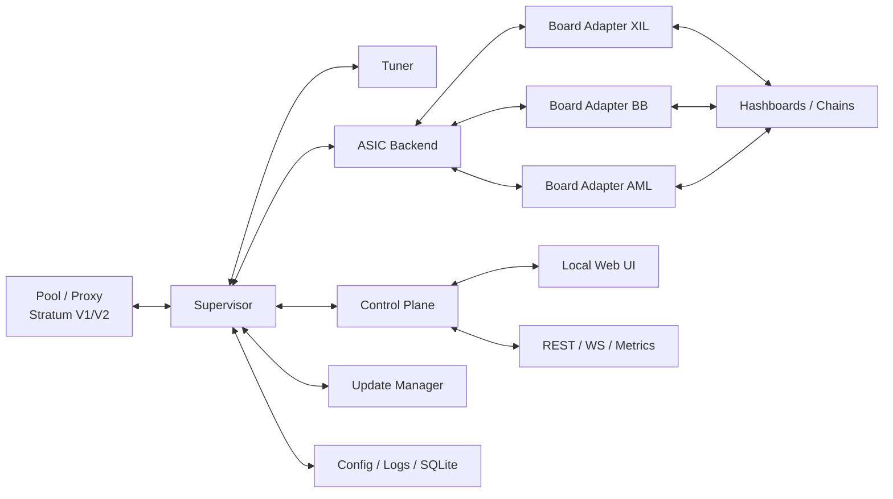
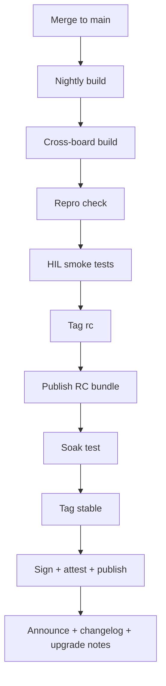

# Otevřený mining OS pro Antminer S19-class

## Exekutivní shrnutí

Primární zdroje ukazují poměrně jasný obraz trhu. **Braiins OS** je dnes nejvyspělejší „hybrid“: má veřejné API na gRPC, část build/tooling repozitářů na GitHubu, otevřené hardwarové artefakty kolem BCB100, ale zároveň zůstává komerční produkt s automaticky účtovaným devfee a closed-source Toolboxem. **LuxOS** je silně zdokumentovaný enterprise firmware se 2,8% fee, Commander workflow, profile-based i power-target řízením a aktivním changelogem. **VNish** má velmi praktické pokrytí S19/T19 rodiny, široké instalační cesty a tooling, ale je uzavřený a fee model je v jeho vlastních materiálech uváděn jako 1,8–2,8 %, resp. na homepage zjednodušeně 2,8 %. **DCENT_OS** je filozoficky nejbližší cíli „plně otevřeného miner OS s volitelným příspěvkem“, ale veřejné materiály si zatím protiřečí: marketing mluví o GPL‑3.0 a 0% mandatory devfee, zatímco oficiální GitHub repozitář říká, že pre‑v1 kód je stále neveřejný a plný source release teprve přijde. citeturn23view0turn23view1turn23view3turn30search14turn26view0turn26view1turn26view2turn26view3turn26view4turn25view0turn8view2turn8view3turn13view0turn13view1

Nejdůležitější technická realita pro **S19j Pro** je, že to není jedna platforma, ale nejméně tři relevantní řídicí desky: **Xilinx/Zynq**, **BeagleBone Black** a **Amlogic**. Liší se nejen SoC, ale i tím, odkud se zařízení fyzicky recoveruje: Xilinx má přístupný SD slot zvenku, BBB má SD slot uvnitř pod krytem a Amlogic má typicky jen micro‑USB/OTG. Braiins navíc výslovně píše, že všechny tři varianty mají secure boot, a VNish zase oficiálně popisuje, že u novějších stock buildů mohou být některé instalační cesty přes toolkit nebo SD omezené. Bitmain k tomu přidává vlastní preflight: typ boardu lze ověřit přes `miner_type.cgi`, a při upgradu varuje před přerušením napájení, které může board poškodit. Z toho plyne klíčový návrhový závěr: **open firmware pro S19j Pro musí být recovery-first, ne web-upgrade-first**. citeturn24view0turn25view0turn14search7turn14search3turn14search6turn28search0

Doporučená architektura proto stojí na pěti rozhodnutích. Za prvé: **Buildroot external tree** pro minimální, deterministický runtime a snadněji reprodukovatelné image. Za druhé: **A/B update model** se signed bundles, rollbackem a odděleným rescue režimem. Za třetí: **lokální API-first vrstva** nad low-level backendem, protože dnešní produkty veřejně nabízejí buď gRPC (Braiins), nebo CGMiner/LUXminer-style přístup na portu 4028 (LuxOS, VNish), ale prostor pro čisté REST + WebSocket + Prometheus API stále zůstává. Za čtvrté: **GPL‑3.0** jako výchozí licence, protože firmware v uzamčeném hardwaru přesně odpovídá scénáři, kde je anti‑tivoization rozumná ochrana, a mining prostor má doloženou historii GPL problémů. Za páté: **volitelný a auditovatelný příspěvek na vývoj**, defaultně 0 %, s veřejně zdokumentovanou implementací a bez skrytých fallback poolů. citeturn22view0turn16search13turn16search1turn16search10turn16search15turn23view1turn26view2turn10search0turn20search1turn24view0turn13view1

## Co ukazují primární zdroje

Instalační a recovery realita pro S19j Pro je dnes dobře zdokumentovaná, ale roztříštěná napříč výrobci a aftermarket firmwary. Braiins popisuje tři hlavní board varianty a jejich fyzické rozdíly; LuxOS dává konkrétní recovery workflow pro BeagleBone i Amlogic; VNish na ruské oficiální stránce popisuje Xilinx, BB, AML i CVitek a přidává praktická omezení podle data stock firmwaru; Bitmain doplňuje vlastní recovery a identifikaci typu boardu. Proto má smysl stavět komunitní projekt tak, aby každý board family měl **samostatný bootstrap/recovery příběh**, nikoli univerzální „nahraj soubor přes web“. citeturn24view0turn26view3turn28search0turn25view0turn14search7

V oblasti otevřenosti je situace asymetrická. Braiins má veřejné repozitáře pro Public API, balíčky, build system pro BCB a repo s prebuilt boot-chain artefakty kvůli repeatability; současně ale Toolbox není open source a licenční popis OS jasně říká, že se devfee automaticky odečítá. LuxOS a VNish publikují rozsáhlé docs a API příkazy, ale ne veřejný runtime source. DCENT_OS je v tomto směru nejzajímavější – jeho web staví messaging na GPL‑3.0 a optional contribution, ale GitHub README současně říká, že plný source přijde až ve `v1` a aktuálně jde o private beta/public-beta transition. To je přesně mezera, do které dává smysl vstoupit s projektem, který **nebude „slibovat open-source později“, ale od prvního veřejného release ho skutečně dodá**. citeturn23view1turn23view3turn29view0turn29view1turn29view2turn26view2turn8view2turn13view0turn13view1

Na úrovni build/release hygiene jsou relevantní tři facts. Buildroot výslovně počítá s tím, že projektové customizace mají být ukládány tak, aby šel stejný image znovu sestavit reprodukovatelně. Reproducible‑builds.org definuje reprodukovatelný build jako bit‑for‑bit identický výstup ze stejného source, build environmentu a instrukcí a upozorňuje, že timestampy bývají největším zdrojem problému. GitHub Actions dnes umí artifact attestations a Sigstore/cosign umí keyless signing. Pro komunitní firmware je proto realistický standard: **pinované zdroje + `SOURCE_DATE_EPOCH` + SBOM + attestation + podpis releasu**. citeturn22view0turn16search13turn16search1turn16search10turn16search15

## Návrhové závěry

Doporučuji projekt koncipovat jako **OpenMinerOS** (pracovní název), s těmito závaznými pravidly:

1. **Celý runtime a celý build chain veřejně**. Výjimky typu boot-chain blobů musí být explicitně sepsány, hashed a odůvodněny; ne „někde ve scripts/“. To je praktická lekce i z veřejných Braiins repo artefaktů pro repeatability. citeturn29view0turn29view1

2. **MVP musí být konzervativní**. V1 nemá být „nejvyšší hashrate“, ale „bootuje, těží, nebrickuje, rollbackuje“. To je důležitější než okamžitý autotune arms race, zvlášť na platformě s více board variantami a secure boot omezeními. citeturn24view0turn25view0turn14search3turn14search6

3. **API vrstva má být moderní a normální**. Vedle interního low-level transportu má mít projekt veřejné REST API, WebSocket event stream a Prometheus endpoint. Braiins ukazuje, že veřejné API je pro integrace zásadní; LuxOS a VNish naopak připomínají, že staré CGMiner-style API je použitelné, ale dnes už není ideální jako jediná integrační vrstva. citeturn23view1turn26view2turn10search0

4. **Stratum V2 má být architektonicky připravený, ale ne MVP blocker**. Oficiální specifikace je stabilní a protokol už má jasně oddělené role Mining Protocol / Job Negotiation / Template Distribution. Pro první komunitní release ale dává smysl dodat nejdřív spolehlivý low-level runtime a A/B update story, teprve pak plnou SV2 vrstvu. citeturn21search7turn21search0turn21search1

5. **GPL‑3.0 je zde lepší než permissive licence**. GNU samo zdůrazňuje ochranu proti tivoization a Braiins veřejně píše, že mining průmysl má dlouhodobý problém s GPL porušováním kolem CGMiner forků. Pro firmware běžící na vlastněném hardwaru je silný copyleft v tomto segmentu racionální, ne ideologický. citeturn20search1turn24view0

## Srovnání s existujícími firmwary

| Firmware | Otevřenost | Devfee | Veřejné API / tooling | S19j Pro BB/XIL/AML | Provozní zralost |
|---|---|---:|---|---|---|
| Braiins OS | Hybridní: veřejné API a část build/tooling rep, ale Toolbox closed | 2–2,5 % | gRPC Public API, Toolbox, Stratum V2 ready | Ano | Vysoká |
| LuxOS | Uzavřený | 2,8 % | LUXminer/4028 API, Commander | Ano | Vysoká |
| VNish | Uzavřený | 1,8–2,8 % | HashCore Toolkit, 4028 API rozšíření | Ano | Střední až vysoká |
| DCENT_OS | Cílově GPL‑3.0, ale plný source zatím nepublikován | 0 % default, optional contribution | Deklarované REST + WebSocket, beta tooling | Beta na S19j Pro | Nízká až střední |
| Navrhovaný OpenMinerOS | GPL‑3.0, celý runtime a build chain veřejně | 0 % default, opt-in contribution | REST + WebSocket + Prometheus + Commander | Ano | Cíl: konzervativní MVP, poté vysoká |

Hodnocení zralosti je zde redakční odhad opřený o veřejně dostupné release/change docs, šíři podpory boardů a explicitní beta/stable status, nikoli o neveřejné SLA. Hodnoty v tabulce vycházejí z oficiálních materiálů Braiins, Luxor, VNish a D‑Central/GitHub. citeturn23view0turn23view1turn23view3turn30search14turn26view0turn26view1turn26view2turn26view3turn26view4turn25view0turn8view2turn8view3turn13view0turn13view1

| Board family | Fyzický znak | Oficiálně doložená instalační cesta | Návrhový dopad pro OpenMinerOS |
|---|---|---|---|
| Xilinx / Zynq | SD slot zvenku | SD bootstrap, následně remote/batch install | Nejjednodušší recovery; ideální referenční board pro první veřejné image |
| BeagleBone Black | SD slot uvnitř pod krytem | SD recovery → NAND/eMMC → Commander | Nutná jasná servisní dokumentace a instrukce pro shroud removal |
| Amlogic | Bez SD, pouze micro‑USB/OTG | OTG/USB recovery image, teprve potom remote install | Vlastní OTG rescue path je povinný; web-only instalace nestačí |

Tahle tabulka je přímo odvozená z oficiální dokumentace Braiins, LuxOS a VNish a je to nejsilnější argument pro to, aby měl komunitní firmware samostatné instalátory a recovery flow podle board family. citeturn24view0turn26view3turn28search0turn25view0

## Navržené rozložení repozitáře

```text
openmineros/
├── README.md
├── LICENSE
├── CODE_OF_CONDUCT.md
├── CONTRIBUTING.md
├── GOVERNANCE.md
├── SECURITY.md
├── ARCHITECTURE.md
├── INSTALL.md
├── UPGRADE.md
├── BUILD.md
├── RELEASE.md
├── API.md
├── CONFIG.md
├── TELEMETRY.md
├── DEVFEE.md
├── HARDWARE_MATRIX.md
├── TESTING.md
├── ROADMAP.md
├── rfcs/
│   └── 0000-template.md
├── .github/
│   ├── ISSUE_TEMPLATE/
│   │   ├── bug_report.md
│   │   ├── feature_request.md
│   │   └── rfc_proposal.md
│   ├── PULL_REQUEST_TEMPLATE.md
│   └── workflows/
│       ├── ci.yml
│       ├── release.yml
│       └── reproducible.yml
├── buildroot/
│   ├── configs/
│   ├── board/
│   ├── overlay/
│   └── external.mk
├── crates/
│   ├── control-plane/
│   ├── supervisor/
│   ├── tuner/
│   ├── asic-backend/
│   ├── board-xil/
│   ├── board-bb/
│   ├── board-aml/
│   └── common/
├── web/
├── scripts/
├── images/
└── tests/
    ├── unit/
    ├── integration/
    ├── hil/
    └── soak/
```

## Markdown soubory

### Soubor `README.md`

````md
# OpenMinerOS

OpenMinerOS je otevřený, komunitně řízený mining OS pro Antminer S19-class hardware se zaměřením na **S19j Pro (BB / XIL / AML)**.  
Cíl projektu je jednoduchý:

- plně auditovatelný runtime,
- žádný povinný devfee,
- lokální API a UI bez závislosti na cloudu,
- bezpečné recovery a rollback postupy,
- reprodukovatelné buildy a podepsané release artefakty.

## Stav projektu

Tento repozitář definuje cílovou architekturu, governance a pracovní proces projektu.  
První veřejný cíl je **MVP v1**: bezpečný boot, těžba v konzervativním režimu, podepsané A/B aktualizace, lokální web UI, REST API a recovery flow pro Xilinx, BeagleBone a Amlogic.

## Principy

1. **Open by default**  
   Veřejný source, veřejný changelog, veřejné RFC.

2. **Recovery-first**  
   Žádná změna nesmí zhoršit možnost zařízení obnovit.

3. **Local-first**  
   Web UI, API i telemetry fungují lokálně. Cloud je vždy jen volitelná nadstavba.

4. **Transparent contribution model**  
   Povinný devfee = nikdy. Volitelný příspěvek na vývoj = ano, ale auditovatelně.

5. **Conservative by default**  
   Výchozí profil je bezpečný a predikovatelný. Agresivní tuning je opt-in.

## Cílový rozsah MVP

- Antminer S19j Pro
- Control board:
  - Xilinx / Zynq
  - BeagleBone Black
  - Amlogic
- Lokální web dashboard
- REST API + WebSocket + Prometheus metrics
- Pool failover
- Konzervativní tuning profil
- Penalizace / izolace vadného chainu
- A/B aktualizace s automatickým rollbackem
- SD / OTG / Commander instalace

## Co OpenMinerOS není

- Není to cloud management produkt.
- Není to “nejvyšší možný OC za každou cenu”.
- Není to uzavřený vendor stack s neauditovatelnými pool redirecty.
- Není to projekt, kde je low-level část “dočasně neveřejná”.

## Dokumentace

- `ARCHITECTURE.md` – řídicí roviny, tuner, supervisor, low-level backend
- `INSTALL.md` – BB / XIL / AML / Commander instalace a recovery
- `UPGRADE.md` – aktualizace, rollback a downgrade politika
- `BUILD.md` – build, CI, reproducibility
- `RELEASE.md` – release flow a podpis artefaktů
- `API.md` – REST / WebSocket / Prometheus
- `CONFIG.md` – konfigurační schéma
- `TELEMETRY.md` – eventy, metriky, retention
- `DEVFEE.md` – volitelný contribution model
- `HARDWARE_MATRIX.md` – podporovaný hardware a testovací cíle
- `TESTING.md` – test plán, HIL, soak testy
- `ROADMAP.md` – MVP v1–v3 a první issues
- `GOVERNANCE.md` – Maintainers, RFC a rozhodovací pravidla
- `CONTRIBUTING.md` – jak přispívat
- `SECURITY.md` – disclosure, hardening, support policy

## Rychlý start

1. Identifikuj control board a model.
2. Použij odpovídající recovery/install cestu z `INSTALL.md`.
3. Po prvním bootu změň heslo správce.
4. Nastav pooly a síť.
5. Ověř:
   - že běží všechny očekávané chainy,
   - že teploty a ventilátory jsou v normě,
   - že se aktivní slot po update správně přepíná.

## Repo struktura

```text
crates/        Rust runtime moduly
buildroot/     image build a overlay
web/           lokální web UI
scripts/       flashe, release helpery, verifikace
tests/         unit, integration, HIL, soak
rfcs/          návrhy větších změn
.github/       issue templaty, PR template, CI
```

## Contribution model

Výchozí nastavení contribution rate je `0.0 %`.

Projekt podporuje volitelný příspěvek na vývoj pouze za těchto podmínek:

- aktivace je explicitní,
- plán contribution oken je veřejně popsaný,
- endpointy jsou veřejně vyjmenované,
- UI/API/metryky vždy ukazují, kdy a kolik bylo odesláno,
- při výpadku contribution endpointu se těžba vrací na uživatelovy pooly.

Detaily v `DEVFEE.md`.

## Licence

Projekt je navržen pro licenci **GPL-3.0-only**.  
Praktický důvod: kdo redistribuuje firmware, musí redistribuovat i úpravy.

## Stav podpory

Viz `HARDWARE_MATRIX.md`.

## Komunitní pravidla

- RFC pro větší změny
- DCO místo CLA
- žádné tajné binárky bez explicitního exception listu
- žádné nezdokumentované pool redirecty
````

### Soubor `ARCHITECTURE.md`

````md
# Architektura OpenMinerOS

Tento dokument definuje referenční architekturu projektu OpenMinerOS pro Antminer S19j Pro s board family XIL / BB / AML.

## Cíle architektury

- oddělit UI/API od těžebního runtime,
- oddělit bezpečné rozhodování od low-level I/O,
- umožnit různé control board adaptéry bez rozbití vyšších vrstev,
- udržet recovery a update logiku oddělenou od mining procesu,
- minimalizovat rozsah změn při přidání nové board family.

## Vysoká úroveň



## Control plane

Control plane je vrstva, kterou vidí operátor a externí integrace.

### Obsah

- HTTP server
- autentizace a session management
- REST API
- WebSocket event stream
- Prometheus endpoint
- statické web UI
- změny konfigurace
- zobrazení health a logů
- update orchestrace
- contribution model přepínače

### Pravidla

- control plane **nikdy** přímo nesahá na low-level registry,
- control plane mluví pouze se supervisorem přes interní RPC / message bus,
- každá mutace je auditována.

## Supervisor

Supervisor je “mozek” runtime.

### Odpovědnosti

- start/stop mining procesu
- správa poolů a failover
- lifecycle chainů
- watchdog
- thermal a safety policy
- koordinace update / rollback
- publikace jednotného stavu systému
- řízené přepínání profilů
- izolace vadného chainu

### Stavový model

Supervisor drží explicitní stav:

- `booting`
- `recovering`
- `idle`
- `starting`
- `mining`
- `degraded`
- `safe_mode`
- `updating`
- `rollback_pending`
- `fault`

Supervisor je jediná vrstva, která smí rozhodnout o:

- vypnutí chainu,
- snížení výkonu kvůli teplotě,
- přepnutí aktivního slotu po upgradu,
- vstupu do safe mode.

## Tuner

Tuner je samostatná logická vrstva, nikoli ruční UI feature.

### Odpovědnosti

- práce s profily
- konzervativní default profil
- thermal-aware omezení výkonu
- autotune orchestrace
- chain balancing
- domain/frequency policy
- per-chain quarantine
- validace manual override

### Režimy

- `stock_like`
- `eco`
- `balanced`
- `performance`
- `manual`
- `safe_mode`

### MVP pravidla

V MVP v1:

- manual je omezený,
- profile switching je povolen bez rebootu celého zařízení,
- agresivní autotune je opt-in,
- supervisor může tuner přebít při bezpečnostní události.

## Low-level ASIC backend

Low-level backend abstrahuje rozdíly mezi board family a hashboard implementací.

### Rozhraní

Backend musí poskytovat alespoň:

- detekci chainů
- enumeraci ASIC
- čtení teplot
- čtení otáček ventilátorů
- čtení napětí / proudu pokud dostupné
- nastavení frekvence / bezpečné voltage policy
- start / stop hashing
- sběr HW errorů
- čtení EEPROM / board identity kde je legálně a bezpečně dostupné

### Zásady

- žádná business logika v board adapterech,
- žádné skryté heuristiky mimo tuner,
- každá low-level chyba je přeložena na stabilní fault kód.

## Board adaptéry

Každá board family má vlastní adaptér:

### XIL

- první referenční implementace
- nejsnazší bootstrap přes SD
- preferovaná platforma pro první HIL testy

### BB

- vyžaduje interní SD recovery
- boot / NAND flow se liší od XIL
- musí mít samostatný recovery smoke test

### AML

- recovery přes micro-USB/OTG
- bez OTG rescue není podpora považována za dokončenou
- remote install není náhradou za rescue flow

## Update manager

Update manager je oddělený od běžného UI upgradu.

### Odpovědnosti

- verifikace podpisu
- verifikace manifestu
- zápis do neaktivního slotu
- přepnutí boot targetu
- health check po restartu
- automatický rollback po failu

## Perzistence

### Rozdělení dat

- immutable rootfs
- samostatný datový oddíl
- SQLite pro lokální stav
- textové logy v rotaci
- export bundle pro debug

### Co se nesmí ztratit při update

- pooly
- síťová konfigurace
- auth nastavení
- contribution nastavení
- thermal limity
- audit log

## Failure domains

Architektura rozlišuje tyto failure domains:

- UI/API chyba
- tuner chyba
- single chain failure
- board adapter failure
- thermal fault
- update failure
- persistence corruption

Každý domain musí mít samostatnou recovery strategii.

## Rozšiřitelnost

Přidání nové board family nebo hashboard třídy nesmí vyžadovat:

- změnu REST API contractu,
- změnu UI datového modelu,
- přepis tuneru.

Smí vyžadovat:

- nový board adapter,
- nové capability flagy,
- nové testy v HIL matrix.

## Design decisions

- Runtime psát primárně v Rustu.
- Image stavět přes Buildroot external tree.
- UI držet jako lokální statický bundle.
- Žádný cloud dependency v runtime.
- Žádná “magic” fee logika mimo veřejně zdokumentovaný scheduler.
````

### Soubor `INSTALL.md`

````md
# Instalace a recovery

Tento dokument popisuje instalační a recovery cesty pro:

- Xilinx / Zynq
- BeagleBone Black
- Amlogic
- Commander (síťová hromadná instalace)

## Bezpečnostní pravidla

Před každým flashováním:

1. zajisti stabilní napájení,
2. zálohuj pooly a síť,
3. potvrď model a board family,
4. nepřerušuj napájení během zápisu,
5. měj připravenou recovery cestu pro daný board.

## Identifikace control boardu

Použij jednu ze dvou metod:

### Softwarová metoda

Na stock firmwaru zjisti board type z identifikačního endpointu, pokud je dostupný.

### Fyzická metoda

- XIL: SD slot přístupný zvenku
- BB: SD slot uvnitř pod krytem
- AML: bez SD slotu, pouze micro-USB

## Společný preflight

- model: `S19j Pro`
- PSU: ověřené a stabilní
- ventilátory: funkční
- síť: DHCP nebo připravená statická IP
- recovery média:
  - XIL / BB: microSD
  - AML: OTG + recovery image

## Instalace přes Xilinx / Zynq

### Co potřebuješ

- 8–16 GB microSD
- obraz `openmineros-xil-jpro-<ver>-install.img.xz`
- fyzický přístup k mineru

### Postup

1. Nahraj recovery/install image na microSD.
2. Vypni miner a počkej, až doběhnou ventilátory.
3. Zasuň microSD do externího SD slotu.
4. Zapni miner.
5. Počkej na boot rescue prostředí.
6. Otevři web UI rescue módu nebo použij Commander.
7. Zvol `Install to NAND / Slot B`.
8. Po dokončení vypni zařízení, vyjmi SD.
9. Znovu zapni a ověř, že bootuje OpenMinerOS.

### Ověření

- aktivní web UI
- zobrazený aktivní slot
- načtený model a board capabilities
- žádné fault eventy při bootu

## Instalace přes BeagleBone Black

### Co potřebuješ

- 8–16 GB microSD
- obraz `openmineros-bb-jpro-<ver>-install.img.xz`
- přístup pod kryt control boardu

### Postup

1. Nahraj image na microSD.
2. Vypni miner.
3. Otevři kryt control boardu.
4. Zasuň microSD do interního SD slotu.
5. Zapni miner.
6. Nabootuj do rescue image.
7. Spusť instalaci do interního úložiště / neaktivního slotu.
8. Po dokončení miner vypni.
9. Vyjmi microSD.
10. Zavři kryt a znovu zapni.

### Ověření

Stejné jako u XIL + navíc:

- zkontroluj, že po vyjmutí SD bootuje interní instalace.

## Instalace přes Amlogic

### Co potřebuješ

- OTG kabel
- recovery image `openmineros-aml-jpro-<ver>-install.zip`
- microSD/USB konvertor podle recovery sady
- fyzický přístup k micro-USB portu

### Postup

1. Připrav recovery médium podle AML sady.
2. Vypni miner.
3. Připoj OTG kabel.
4. Připoj recovery médium do OTG adaptéru.
5. Zapni miner.
6. Nabootuj rescue prostředí.
7. Otevři dočasné UI nebo použij Commander.
8. Nainstaluj runtime do neaktivního slotu.
9. Vypni, odpoj OTG, znovu zapni.
10. Ověř normální boot.

### Ověření

- web UI dostupné bez OTG
- model a board capabilities odpovídají AML variantě
- update manager hlásí oba sloty korektně

## Commander instalace

Commander je síťový instalační nástroj projektu OpenMinerOS.

### Použití

Commander podporuje:

- sken sítě
- identifikaci modelu a board family
- push podepsaného image
- skupinový install
- skupinový verify
- skupinový rollback

### Postup

1. Spusť `omo-commander scan`.
2. Potvrď detekované IP a board family.
3. Vyber cílovou skupinu.
4. Nahraj správný image bundle.
5. Spusť `install --slot inactive`.
6. Po zápisu proveď `verify`.
7. Teprve poté proveď controlled reboot.

### Kdy Commander nepoužívat

- board je v boot loopu,
- web/ssh stocku není dostupný,
- board family není spolehlivě detekovaná,
- AML nemá funkční rescue path.

## První boot

Po prvním bootu proveď:

1. změnu admin hesla,
2. nastavení poolů,
3. nastavení sítě,
4. ověření ventilátorů,
5. ověření teplot,
6. ověření chainů,
7. export support bundle.

## Recovery a brick postupy

## Soft brick

Příznaky:

- boot loop,
- UI nenaběhne,
- update nedokončen,
- miner je v rollback pending.

Postup:

1. neztrácej čas opakovanými restarty,
2. přejdi do rescue flow podle board family,
3. ověř sloty,
4. aktivuj poslední known-good slot nebo přeinstaluj.

## Fault po upgradu

Pokud po upgradu:

- neběží mining,
- chainy nejsou enumerovány,
- sensor fault blokuje start,

proveď boot do rescue, stáhni support bundle a teprve potom rollback.

## Hard brick

Příznaky:

- žádný boot,
- žádná síť,
- žádné LED pattern,
- board nereaguje ani v rescue cestě.

Postup:

1. ověř PSU a kabeláž,
2. ověř recovery médium,
3. zkus znovu čistý rescue boot,
4. pokud stále nic, označ board jako lab-only a neprováděj další opakované pokusy v provozu.

## Co je release blocker

Release se nepovažuje za připravený, pokud není ověřeno:

- XIL fresh install,
- BB fresh install,
- AML fresh install,
- rollback na known-good slot,
- recovery po záměrně poškozené konfiguraci.
````

### Soubor `UPGRADE.md`

````md
# Aktualizace a rollback

OpenMinerOS používá **A/B update model**.

## Cíl

- minimalizovat brick risk,
- umožnit bezpečný rollback,
- dělat upgrade bez přepisu běžícího slotu,
- oddělit update od config a telemetry dat.

## Sloty

- `slot_a` – bootovatelný rootfs
- `slot_b` – bootovatelný rootfs
- `data` – konfigurace, logy, SQLite
- `rescue` – minimální recovery prostředí

## Release kanály

- `stable` – doporučený produkční kanál
- `rc` – kandidát na release
- `nightly` – vývojový build bez produkční garance
- `lts` – bezpečnostní backporty pro vybrané verze

## Upgrade workflow

1. Operátor vybere release.
2. Updater stáhne bundle a manifest.
3. Ověří:
   - verzi,
   - kompatibilitu board family,
   - podpis,
   - hash artefaktů.
4. Zapíše image do neaktivního slotu.
5. Migruje databázové schéma, pokud je potřeba.
6. Nastaví `boot_once` na nový slot.
7. Restartuje zařízení.
8. Supervisor po bootu musí potvrdit health.
9. Pokud health nepotvrdí, bootloader / updater vrátí poslední known-good slot.

## Health potvrzení po upgrade

Nový slot je považován za zdravý pouze tehdy, když:

- boot dokončen,
- control plane běží,
- konfigurace načtena,
- board family detekována,
- watchdog registrace hotová,
- alespoň konzervativní mining mode lze spustit,
- nejsou přítomné critical thermal nebo storage fault.

## Automatický rollback

Rollback se aktivuje automaticky při:

- boot failu,
- crash loopu supervisora,
- nevalidním config migration výsledku,
- critical storage error,
- neschopnosti spustit control plane.

## Ruční rollback

Ruční rollback lze spustit:

- z web UI,
- z REST API,
- z rescue módu,
- přes Commander.

## Downgrade politika

Downgrade je povolen jen pokud:

- release bundle obsahuje kompatibilní migration policy,
- data partition neobsahuje nevratně novější schéma,
- board family je stejná.

Pokud downgrade není bezpečný, updater to musí odmítnout před restartem.

## Zachování konfigurace

Při upgradu se zachovává:

- síť
- pooly
- auth
- thermal limity
- contribution nastavení
- log retention preference

## Co se nikdy nepřenáší mezi sloty bez kontroly

- cache autotune experimentů nekompatibilní s verzí
- neznámé plugin state
- debug override flagy
- nevalidní ruční low-level nastavení

## Release compatibility contract

Každý release musí deklarovat:

- minimální podporovanou verzi upgradu,
- minimální rescue verzi,
- podporované board family,
- breaking changes,
- known issues,
- rollback compatibility.

## Best practices pro operátory

- neupgradovat všechny minery najednou,
- vždy začít 1 kusem od každé board family,
- po upgradu ověřit teploty, fan policy a accepted shares,
- až poté dělat batch rollout.
````

### Soubor `BUILD.md`

````md
# Build, CI a reprodukovatelnost

Tento dokument popisuje, jak se staví image OpenMinerOS a jak funguje CI.

## Build principy

- jeden repozitář = jeden zdroj pravdy,
- pinované zdroje a hashované vendor tarbally,
- žádné buildy proti plovoucím branchím,
- deterministický builder image,
- `SOURCE_DATE_EPOCH` odvozený z releasovaného commitu,
- výstupy ověřované druhým nezávislým buildem.

## Technologie

- Buildroot external tree
- Rust pro runtime
- Node/TypeScript pro web UI build
- Podman/Docker builder image s pinovaným digestem
- GitHub Actions pro CI
- diffoscope + sha256 pro repro check

## Lokální build

### Předpoklady

- Linux x86_64
- Podman nebo Docker
- `make`
- 30+ GB volného místa

### Základní příkazy

```bash
make bootstrap
make image BOARD=s19-xil MODEL=s19j-pro
make image BOARD=s19-bb MODEL=s19j-pro
make image BOARD=s19-aml MODEL=s19j-pro
make verify-repro BOARD=s19-xil MODEL=s19j-pro
```

## Výstupy buildů

Každý release bundle musí obsahovat:

- install image
- sysupgrade bundle
- manifest
- `sha256sum.txt`
- SBOM (`spdx.json`)
- attestation
- podpis / podpisový bundle
- release notes

## CI pipeline

```mermaid
flowchart LR
    A[Push / PR] --> B[Lint]
    B --> C[Unit tests]
    C --> D[Cross-build Rust crates]
    D --> E[Web build]
    E --> F[Buildroot image build]
    F --> G[SBOM generation]
    G --> H[Second rebuild]
    H --> I[Hash compare + diffoscope]
    I --> J[Sign + attest]
    J --> K[Upload artifacts]
```



## CI jobs

### Lint

- rustfmt
- clippy
- eslint
- markdownlint
- shellcheck

### Test

- Rust unit testy
- web unit testy
- config schema validace
- API contract validace

### Build

- build image pro:
  - XIL
  - BB
  - AML

### Reproducibility

- nezávislý rebuild stejného commitu
- porovnání hashů
- při rozdílu diffoscope report

## Reprodukovatelnost

Build je považován za reprodukovatelný pouze tehdy, pokud:

- manifest zdrojů odpovídá,
- builder image digest odpovídá,
- `SOURCE_DATE_EPOCH` odpovídá,
- artefakty mají identický hash.

## Supply chain artefakty

Každý release produkuje:

- SBOM
- provenance attestation
- podpis release bundle
- zveřejněný digest list

## CI gate pravidla

PR se nesmí mergnout, pokud:

- padá lint,
- padá unit test,
- buildne se jen část board family,
- změna low-level vrstvy nemá odpovídající test update,
- release profil není reprodukovatelný.
````

### Soubor `RELEASE.md`

````md
# Release workflow

Tento dokument definuje, jak se z commitu stane veřejný release.

## Cíle

- předvídatelné releasy,
- veřejná provenance,
- snadný rollback,
- jasné kanály pro operátory i vývojáře.

## Verzionování

OpenMinerOS používá SemVer:

- `MAJOR` – breaking změny
- `MINOR` – nové funkce
- `PATCH` – opravy a bezpečnostní backporty

Příklady:

- `v1.0.0`
- `v1.1.0-rc1`
- `v1.1.2`

## Release kanály

- `nightly`
- `rc`
- `stable`
- `lts`

## Release flow



## Požadované artefakty

- `openmineros-<board>-<version>-install.img.xz`
- `openmineros-<board>-<version>-sysupgrade.tar`
- `manifest.json`
- `sha256sum.txt`
- `sbom.spdx.json`
- `attestation.intoto.jsonl`
- `release-notes.md`

## Release checklist

### RC checklist

- všechny board family buildí,
- release notes hotové,
- known issues sepsané,
- rollback ověřený,
- HIL smoke test hotový.

### Stable checklist

- úspěšný soak test,
- žádný open critical bug,
- podpisy a attestation v pořádku,
- upgrade from previous stable ověřen.

## Podpis a provenance

Každý stable release:

- musí být podepsaný,
- musí mít zveřejněný digest,
- musí mít provenance attestation,
- musí být ověřitelný bez interních klíčů projektu.

## Changelog pravidla

Každý release notes musí mít sekce:

- Added
- Changed
- Fixed
- Security
- Upgrade notes
- Recovery notes
- Known issues

## Emergency release

Pro bezpečnostní incident lze vydat emergency patch release.

Požadavky:

- jasná identifikace CVE / security issue nebo incident class,
- co nejmenší diff,
- povinné rollback testy,
- zkrácený, ale nevynechaný signing a attestation flow.
````

### Soubor `API.md`

````md
# API specifikace

OpenMinerOS poskytuje tři veřejná rozhraní:

- REST API
- WebSocket event stream
- Prometheus metrics

Všechna veřejná API jsou verzovaná pod `/api/v1`.

## Zásady

- JSON request/response
- stabilní resource naming
- explicitní error model
- žádné side effects u GET
- každá mutace auditovaná
- auth povinné pro write operace

## Autentizace

### Login

`POST /api/v1/auth/login`

```json
{
  "username": "admin",
  "password": "secret"
}
```

### Response

```json
{
  "token": "jwt-or-session-token",
  "expires_in": 86400,
  "roles": ["admin"]
}
```

### Logout

`POST /api/v1/auth/logout`

## REST endpointy

## System

### GET `/api/v1/system/info`

Vrací:

- model
- board family
- firmware version
- active slot
- uptime
- serial
- capabilities

### GET `/api/v1/system/health`

Vrací agregovaný health model.

```json
{
  "state": "mining",
  "severity": "ok",
  "issues": [],
  "active_slot": "b",
  "rollback_available": true
}
```

### POST `/api/v1/system/reboot`

### POST `/api/v1/system/rollback`

## Mining

### GET `/api/v1/miner/status`

```json
{
  "hashrate_ths": 102.4,
  "power_w": 3010,
  "efficiency_j_th": 29.4,
  "accepted_shares": 12540,
  "rejected_shares": 21,
  "mode": "balanced"
}
```

### GET `/api/v1/chains`

Vrací seznam chainů a jejich stav.

```json
[
  {
    "id": 0,
    "present": true,
    "enabled": true,
    "asic_detected": 42,
    "temp_board_c": 63.1,
    "temp_chip_max_c": 79.3,
    "fault": null
  }
]
```

### POST `/api/v1/chains/{id}/enable`

### POST `/api/v1/chains/{id}/disable`

## Tuning

### GET `/api/v1/profiles`

### POST `/api/v1/profiles/activate`

```json
{
  "profile": "balanced",
  "apply_mode": "live"
}
```

### POST `/api/v1/tuner/target`

```json
{
  "type": "watts",
  "value": 2950
}
```

### POST `/api/v1/tuner/manual`

```json
{
  "chain": 1,
  "frequency_mhz": 540,
  "voltage_v": 13.4
}
```

## Pools

### GET `/api/v1/pools`

### PUT `/api/v1/pools`

```json
{
  "pools": [
    {
      "priority": 0,
      "url": "stratum+tcp://pool.example:3333",
      "user": "acct.worker",
      "password": "x",
      "enabled": true
    }
  ]
}
```

## Updates

### GET `/api/v1/update/status`

### POST `/api/v1/update/check`

### POST `/api/v1/update/apply`

### POST `/api/v1/update/rollback`

## Contribution

### GET `/api/v1/contribution/status`

```json
{
  "enabled": false,
  "rate_percent": 0.0,
  "today_scheduled_seconds": 0,
  "today_executed_seconds": 0,
  "current_window": null
}
```

### PUT `/api/v1/contribution/config`

## Logs a audit

### GET `/api/v1/events`

### GET `/api/v1/logs`

### GET `/api/v1/audit`

## Error model

Každá chyba vrací:

```json
{
  "error": {
    "code": "CHAIN_FAULT",
    "message": "Chain 2 is disabled due to repeated init failures",
    "details": {
      "chain": 2
    }
  }
}
```

## WebSocket

Endpoint: `/api/v1/ws`

### Event envelope

```json
{
  "type": "miner.status",
  "ts": "2026-05-06T12:00:00Z",
  "seq": 12345,
  "payload": {}
}
```

### Povinné event typy

- `miner.status`
- `miner.state_changed`
- `chain.fault`
- `chain.recovered`
- `tuner.profile_changed`
- `tuner.target_changed`
- `share.accepted`
- `share.rejected`
- `update.progress`
- `update.rollback`
- `contribution.window_start`
- `contribution.window_end`
- `security.auth_failed`

## Prometheus

Endpoint: `/metrics`

### Příklad metrik

```text
omo_miner_hashrate_ths 102.4
omo_miner_power_watts 3010
omo_miner_efficiency_j_th 29.4
omo_chain_up{chain="0"} 1
omo_chain_up{chain="1"} 1
omo_chain_up{chain="2"} 0
omo_temp_chip_max_celsius{chain="0"} 79.3
omo_fan_rpm{fan="0"} 5820
omo_shares_accepted_total 12540
omo_shares_rejected_total 21
omo_contribution_rate_percent 0
```

## Kompatibilita

- Breaking API změny jen přes nový major.
- Nové fieldy se přidávají aditivně.
- Deprecated fieldy zůstávají minimálně jeden minor release.
````

### Soubor `CONFIG.md`

````md
# Konfigurační schéma

Hlavní konfigurace je uložena v:

```text
/etc/openmineros/config.toml
```

## Příklad

```toml
[device]
hostname = "jpro-01"
site = "lab-a"

[network]
mode = "dhcp"
fallback_ipv4 = "192.168.50.99/24"
gateway = "192.168.50.1"
dns = ["1.1.1.1", "8.8.8.8"]

[[pools]]
priority = 0
url = "stratum+tcp://pool.example:3333"
user = "acct.worker"
password = "x"
enabled = true

[[pools]]
priority = 1
url = "stratum+tcp://backup.example:3333"
user = "acct.worker"
password = "x"
enabled = true

[tuning]
mode = "balanced"
target_type = "watts"
target_value = 2950
autotune = true
chain_quarantine = true

[thermal]
fan_mode = "auto"
fan_min_pwm = 20
fan_max_pwm = 100
hot_chip_c = 90.0
critical_chip_c = 100.0
hot_board_c = 85.0
critical_board_c = 95.0

[api]
listen = "0.0.0.0:8080"
enable_websocket = true
enable_prometheus = true

[logging]
level = "info"
retain_days = 30

[updates]
channel = "stable"
auto_check = true
auto_apply = false
require_signed_release = true

[contribution]
enabled = false
rate_percent = 0.0
mode = "time_slice"
public_proof = true

[telemetry]
local_retention_days = 30
remote_export = false
```

## Schéma po sekcích

## `[device]`

| Klíč | Typ | Povinné | Default | Poznámka |
|---|---|---:|---|---|
| `hostname` | string | ano | – | unikátní jméno v síti |
| `site` | string | ne | `default` | lokalita / rack / lab |

## `[network]`

| Klíč | Typ | Povinné | Default | Poznámka |
|---|---|---:|---|---|
| `mode` | enum | ano | `dhcp` | `dhcp` / `static` |
| `fallback_ipv4` | string | ne | – | emergency fallback |
| `gateway` | string | ne | – | pro static mode |
| `dns` | array | ne | `[]` | seznam DNS |

## `[[pools]]`

Musí existovat alespoň jeden enabled pool.

| Klíč | Typ | Povinné | Default |
|---|---|---:|---|
| `priority` | int | ano | – |
| `url` | string | ano | – |
| `user` | string | ano | – |
| `password` | string | ano | `"x"` |
| `enabled` | bool | ano | `true` |

## `[tuning]`

| Klíč | Typ | Povinné | Default |
|---|---|---:|---|
| `mode` | enum | ano | `stock_like` |
| `target_type` | enum | ano | `watts` |
| `target_value` | number | ano | – |
| `autotune` | bool | ano | `true` |
| `chain_quarantine` | bool | ano | `true` |

## `[thermal]`

| Klíč | Typ | Povinné | Default |
|---|---|---:|---|
| `fan_mode` | enum | ano | `auto` |
| `fan_min_pwm` | int | ano | `20` |
| `fan_max_pwm` | int | ano | `100` |
| `hot_chip_c` | float | ano | `90.0` |
| `critical_chip_c` | float | ano | `100.0` |

## `[api]`

| Klíč | Typ | Povinné | Default |
|---|---|---:|---|
| `listen` | string | ano | `0.0.0.0:8080` |
| `enable_websocket` | bool | ano | `true` |
| `enable_prometheus` | bool | ano | `true` |

## `[updates]`

| Klíč | Typ | Povinné | Default |
|---|---|---:|---|
| `channel` | enum | ano | `stable` |
| `auto_check` | bool | ano | `true` |
| `auto_apply` | bool | ano | `false` |
| `require_signed_release` | bool | ano | `true` |

## `[contribution]`

| Klíč | Typ | Povinné | Default |
|---|---|---:|---|
| `enabled` | bool | ano | `false` |
| `rate_percent` | float | ano | `0.0` |
| `mode` | enum | ano | `time_slice` |
| `public_proof` | bool | ano | `true` |

## Validace

Konfigurační validátor musí odmítnout:

- chybějící enabled pool,
- unsupported board family a profile kombinaci,
- `rate_percent < 0` nebo `> 5`,
- thermal limity v nelogickém pořadí,
- duplicate pool priorities,
- nestrukturované unknown keye v produkčním módu.

## Migrace schématu

Každý release musí poskytovat:

- verzi config schématu,
- migrační skript,
- rollback pravidla.
````

### Soubor `TELEMETRY.md`

````md
# Telemetrie a datový model

OpenMinerOS je **local-first**.  
Telemetrie je lokálně ukládaná a vzdálený export je vždy opt-in.

## Cíle

- umožnit operátorovi diagnostiku,
- umožnit Prometheus scraping,
- neodesílat nic ven bez explicitního zapnutí,
- udržet datový model stabilní.

## Lokální úložiště

### SQLite tabulky

- `miner_status`
- `chain_status`
- `thermal_samples`
- `share_stats`
- `events`
- `audit_log`
- `update_history`
- `contribution_windows`

## Schéma událostí

### `events`

| Pole | Typ | Popis |
|---|---|---|
| `id` | integer | interní ID |
| `ts` | timestamp | čas události |
| `severity` | enum | `info/warn/error/critical` |
| `type` | string | stabilní event typ |
| `component` | string | supervisor / tuner / backend / api |
| `message` | string | čitelný popis |
| `details_json` | json | strukturované detaily |

### Povinné event typy

- `boot.completed`
- `boot.rollback`
- `chain.disabled`
- `chain.recovered`
- `thermal.hot`
- `thermal.critical`
- `pool.primary_down`
- `pool.failover_active`
- `share.reject_spike`
- `update.applied`
- `update.rolled_back`
- `contribution.started`
- `contribution.finished`
- `auth.failed`

## Time-series metriky

### Miner úroveň

- hashrate TH/s
- power W
- efficiency J/TH
- accepted/rejected shares
- uptime
- active pool index

### Chain úroveň

- chain present / enabled
- detected ASIC count
- board temp
- max chip temp
- HW errors
- tuning state

### Fan úroveň

- RPM
- PWM duty

## Prometheus konvence

Prefix všech metrik:

```text
omo_
```

### Core metriky

- `omo_miner_hashrate_ths`
- `omo_miner_power_watts`
- `omo_miner_efficiency_j_th`
- `omo_miner_uptime_seconds`
- `omo_chain_up`
- `omo_chain_asic_detected`
- `omo_chain_hw_errors_total`
- `omo_temp_board_celsius`
- `omo_temp_chip_max_celsius`
- `omo_fan_rpm`
- `omo_shares_accepted_total`
- `omo_shares_rejected_total`
- `omo_update_active_slot`
- `omo_contribution_rate_percent`
- `omo_contribution_executed_seconds_total`

## Retention policy

Default:

- raw thermal/status samples: 7 dní
- 1min rollup: 30 dní
- event log: 90 dní
- audit log: 180 dní
- update history: bez expirace, pokud to dovolí storage budget

## Privacy

Výchozí stav:

- žádný remote export
- žádná anonymní telemetry
- žádná cloud registrace

Pokud operátor remote export zapne, musí být v UI jasně vidět:

- kam se exportuje,
- jaké streamy jsou aktivní,
- kolik dat bylo odesláno.

## Support bundle

Support bundle obsahuje:

- anonymizovatelný config export
- poslední eventy
- thermal snapshot
- pool connectivity snapshot
- slot info
- version info
- optional raw logs

Nikdy nesmí automaticky obsahovat:

- plaintext hesla
- session tokeny
- privátní klíče
````

### Soubor `DEVFEE.md`

````md
# Volitelný příspěvek na vývoj

OpenMinerOS nemá povinný devfee.  
Podporuje pouze **volitelný, transparentní a auditovatelný** contribution model.

## Pravidla

- default je `0.0 %`,
- aktivace je výslovná,
- UI musí ukazovat aktuální stav contribution,
- API musí umět vrátit plánovaná i skutečně provedená okna,
- contribution endpointy jsou veřejně publikované,
- žádný skrytý fallback pool,
- při selhání contribution endpointu se těží pro uživatele.

## Implementační model

Používá se `time_slice` scheduler.

### Jak funguje

- na 24 hodin se spočítá plán contribution oken,
- okna jsou rozprostřená po dni, aby nedělala velké výkonové skoky,
- během aktivního okna se miner přepne na veřejně deklarovaný contribution endpoint,
- po skončení okna se vrátí na uživatelův primární pool.

### Příklad

- `1.0 %` = 14 minut 24 sekund contribution času za 24 hodin
- plán se rozdělí na malá okna
- každé okno je zaznamenané do audit logu

## Transparentnost

UI a API musí ukazovat:

- `enabled`
- `rate_percent`
- `today_scheduled_seconds`
- `today_executed_seconds`
- `current_window`
- `last_endpoint`
- `skip_count` při nedostupném endpointu

## Audit endpoint

`GET /api/v1/contribution/status`

Musí vracet vše potřebné pro nezávislou kontrolu.

## Fork-friendly model

Fork projektu může:

- contribution vrstvu úplně vypnout,
- nastavit vlastní contribution endpointy,
- contribution scheduler nahradit, pokud změnu zdokumentuje.

## Co je zakázané

- skrytý proxy redirect
- nezdokumentovaný backup contribution pool
- obfuskované domény
- aktivace bez souhlasu uživatele
- UI, které contribution skrývá nebo zlehčuje

## Doporučení pro UI

Výrazu “příspěvek na vývoj” dej přednost před “fee”, ale technická dokumentace musí jasně říct, že jde o ekvivalent optional devfee.
````

### Soubor `SECURITY.md`

````md
# Security policy

## Rozsah

Tento dokument popisuje:

- model hrozeb,
- support policy,
- disclosure proces,
- hardening defaults,
- update trust model.

## Support policy

| Verze | Stav podpory |
|---|---|
| aktuální stable | plná podpora |
| předchozí stable minor | security fixes only |
| LTS | dle release plánu |
| nightly / rc | bez produkční garance |

## Threat model

Hlavní hrozby:

1. podvržený update bundle,
2. neautorizovaný přístup do UI/API,
3. skrytý pool redirect,
4. thermal runaway / příliš agresivní tuning,
5. brick po neúspěšném upgradu,
6. únik secrets ze support bundle,
7. supply-chain kompromitace build pipeline.

## Hardening defaults

Výchozí bezpečnostní nastavení:

- SSH vypnuté
- povinná změna hesla po prvním bootu
- write API jen po autentizaci
- rate limit login endpointu
- session expiry
- audit log všech mutací
- signed update bundles
- A/B rollback
- žádný cloud dependency
- žádný remote shell defaultně

## Secrets

- hesla hashovat moderním password hashem
- tokens ukládat minimálně a s expirací
- support bundle nikdy neobsahuje plaintext hesla
- contribution endpoint config nesmí obcházet běžný audit

## Update trust model

Release bundle musí být:

- hashovaný
- podepsaný
- attested
- svázaný s veřejným changelogem a manifestem

Nepodepsaný nebo neznámý bundle se nesmí nainstalovat.

## Disclosure

Zranitelnosti hlaste privátně maintainers/security kontaktu.

Report by měl obsahovat:

- affected version
- board family
- kroky k reprodukci
- očekávané vs skutečné chování
- logy nebo support bundle bez secrets

## Response SLA

Cíl projektu:

- potvrzení přijetí do 72 hodin,
- triage do 7 dnů,
- fix nebo mitigace podle závažnosti.

## Coordinated disclosure

Pro kritické chyby:

- nejdřív fix,
- pak advisory,
- pak veřejný changelog.

## Co je kritická chyba

- RCE bez autentizace
- skrytý pool redirect
- obejití podpisu update
- privilege escalation
- thermal safety bypass
````

### Soubor `GOVERNANCE.md`

````md
# Governance

OpenMinerOS je komunitní projekt s maintainer modelem a veřejným RFC procesem.

## Zásady governance

- rozhodnutí jsou veřejná,
- breaking změny jdou přes RFC,
- žádné CLA,
- DCO ano,
- maintaineři nejsou vlastníci kódu, ale správci procesu.

## Role

## Steering maintainers

Odpovídají za:

- strategii projektu,
- release policy,
- security embargo approval,
- jmenování area maintainerů.

## Area maintainers

Doporučené oblasti:

- control plane
- supervisor
- tuner
- low-level ASIC backend
- board adapters
- build/release
- docs/community

## Release maintainer

Rotující role pro konkrétní release.

## RFC proces

RFC je povinné pro:

- změnu API contractu,
- změnu contribution modelu,
- změnu update modelu,
- breaking config změny,
- novou board family,
- zásah do thermal safety policy,
- nový low-level backend contract.

## Workflow RFC

1. autor vytvoří PR do `rfcs/`
2. použije `0000-template.md`
3. označí scope a dopad
4. proběhne veřejná diskuse
5. area maintainer dá technické stanovisko
6. steering nebo pověření maintainers rozhodnou

## Quorum

RFC je přijato, pokud:

- souhlasí minimálně 2 maintaineři,
- jeden z nich je area maintainer dotčené oblasti,
- nejsou otevřené unresolved blocking concerns.

## Issue a PR triage

- `needs-triage`
- `accepted`
- `needs-rfc`
- `blocked`
- `good first issue`
- `hardware-required`
- `security`

## Contribution pravidla

- malé opravy lze přes běžné PR
- větší změny s dopadem na runtime contract pouze po RFC
- hardware touching změny vyžadují HIL důkaz

## Release branches

- `main`
- `release/x.y`
- `lts/x.y`

## Deprecation policy

- deprecated API/field minimálně 1 minor release
- deprecated config key minimálně 1 minor release
- odstranění pouze s release note a migration note

## Conduct a enforcement

Chování členů komunity se řídí `CODE_OF_CONDUCT.md`.

## Transparentnost

Maintainer rozhodnutí musí být dohledatelná v:

- issue
- PR
- RFC
- release notes

Nikdy ne pouze v soukromém chatu.
````

### Soubor `CONTRIBUTING.md`

````md
# Jak přispívat

Děkujeme za zájem o OpenMinerOS.

## Než začneš

Nejdřív si přečti:

- `README.md`
- `ARCHITECTURE.md`
- `GOVERNANCE.md`
- `TESTING.md`

## Co můžeš poslat bez RFC

- bug fix
- dokumentační opravu
- testy
- cleanup bez změny chování
- UI zlepšení bez změny veřejného contractu

## Co už chce RFC

- breaking API změna
- nový tuning režim
- změna contribution modelu
- změna update / rollback logiky
- nový board adapter
- zásah do low-level contractu

## Vývojové standardy

### Runtime

- Rust
- `cargo fmt`
- `cargo clippy -- -D warnings`
- jednotkové testy povinné

### Web

- TypeScript
- lint + unit testy
- žádná business logika jen v UI

### Shell / tooling

- shellcheck
- idempotentní skripty
- žádné nezdokumentované side effects

### Dokumentace

- změna chování = změna docs ve stejném PR
- změna API = update `API.md`
- změna configu = update `CONFIG.md`

## Hardware-touching změny

Pokud PR mění:

- chain init
- clock/voltage policy
- fan/thermal safety
- board adapter
- updater / boot flow

musí dodat:

- HIL výsledek,
- support bundle nebo test log,
- popis testovaného boardu,
- potvrzení rollback scénáře tam, kde to dává smysl.

## Commit a PR pravidla

- malé, čitelné commity
- jasný název PR
- popis problému a řešení
- odkazy na issue / RFC
- checklist před mergem

## DCO

Projekt používá **Developer Certificate of Origin**.

Každý commit musí mít sign-off:

```text
Signed-off-by: Jméno Příjmení <mail@example.org>
```

## Co nedělat

- neposílej tajné binárky bez vysvětlení,
- neposílej fee logiku bez dokumentace,
- neposílej API změny bez docs,
- neposílej “works on my miner” PR bez reprodukovatelného popisu.

## Kde začít

Hledej labely:

- `good first issue`
- `docs`
- `tests`
- `help wanted`
````

### Soubor `CODE_OF_CONDUCT.md`

````md
# Kodex chování

OpenMinerOS chce být technicky tvrdý projekt a zároveň normální místo pro spolupráci.

## Očekávané chování

- věcná a respektující komunikace,
- kritika návrhu, ne člověka,
- transparentní technická diskuse,
- dobrá vůle při review,
- ochota doložit tvrzení testem nebo logem.

## Nepřijatelné chování

- osobní útoky,
- urážky a ponižování,
- diskriminační nebo obtěžující projevy,
- doxxing,
- opakované zahlcování diskuse bez technického obsahu,
- záměrné skrývání bezpečnostních nebo fee mechanik.

## Review kultura

- “nesouhlasím” je v pořádku,
- “tohle je nesmysl” bez argumentu není review,
- maintainers mají povinnost vysvětlovat reject rozhodnutí.

## Enforcement

Maintaineři mohou:

- upozornit,
- skrýt / uzamknout nevhodný obsah,
- dočasně omezit účast,
- v krajním případě zablokovat účet z projektu.

## Hlášení

Porušení kodexu hlaste maintainerům nebo na určený community/security kontakt.

## Rozsah

Tento kodex se vztahuje na:

- issues
- pull requesty
- RFC diskuse
- release diskuse
- oficiální komunitní kanály projektu
````

### Soubor `TESTING.md`

````md
# Test plán

OpenMinerOS nesmí být vydáván stylem “někomu to bootlo”.  
Testy mají pět vrstev.

## Vrstvy testování

## Unit testy

Cíl:

- čistá business logika
- config validace
- scheduler contribution oken
- API serializers
- state machine supervisora

## Integration testy

Cíl:

- supervisor + tuner spolupráce
- config migration
- update orchestrace
- REST + WebSocket contract
- log/audit pipeline

## Simulační testy

Cíl:

- fault injection
- missing chain
- sensor fault
- pool failover
- thermal threshold crossing

## HIL testy

Hardware-in-the-loop je povinný pro:

- board adaptéry
- chain init
- clock/voltage změny
- update/rollback změny
- fan policy změny

## Soak testy

Před stable release:

- minimálně 24h per board family na referenčním kusu
- minimálně 72h na release kandidátovi pro doporučenou board family
- log bez unexplained crash loopu
- accepted shares bez anomální reject rate

## Test oblasti

## Boot a install

- fresh install XIL
- fresh install BB
- fresh install AML
- boot bez SD/OTG po instalaci
- commander network install

## Mining

- start mining v konzervativním profilu
- pool failover
- disable/enable single chain
- boot s chybějícím chainem
- fault recovery

## Thermal

- hot threshold
- critical threshold
- fan ramp
- safe mode entry
- návrat ze safe mode

## Update

- stable → stable
- stable → rc
- failed boot → rollback
- config migration
- downgrade refusal pokud je nebezpečný

## Security

- auth brute-force limit
- invalid token
- unsigned bundle rejection
- support bundle secret scrub
- contribution transparency audit

## Release gates

Stable release nesmí ven, pokud není splněno:

- všechny CI joby zelené,
- HIL smoke test na všech 3 board family,
- soak test hotový,
- rollback ověřený,
- recovery flow ověřený,
- support bundle export funguje.

## Artefakty z testů

Každý HIL / soak run má uložit:

- board family
- model
- release verzi
- config profil
- runtime délku
- event log
- accepted/rejected shares
- thermal summary
- power summary
- výsledný verdict

## Laboratorní minimum

Viz `HARDWARE_MATRIX.md` pro test rigs a spare parts.
````

### Soubor `HARDWARE_MATRIX.md`

````md
# Hardware matrix

Tento dokument definuje cílovou podporu a validační priority projektu.

## MVP cíl

Primární target je **Antminer S19j Pro**.

## Podpora podle board family

| Model | Control board | SoC | Instalace | Stav cíle |
|---|---|---|---|---|
| S19j Pro | Xilinx / Zynq | Zynq | SD + Commander | MVP stable |
| S19j Pro | BeagleBone Black | AM335x | SD + Commander | MVP stable |
| S19j Pro | Amlogic | A113D | OTG + Commander | MVP stable |
| S19j Pro | CV1835 / CVitek | CV1835 | mimo MVP | v2 experimental |

## Podpora hashboardů

MVP musí být validován minimálně na referenčních S19j Pro hashboard variantách používaných v labu projektu.

Doporučení:

- 1 hlavní referenční varianta
- 1 sekundární validační varianta
- každá další varianta až po green HIL

## Capability flags

Každá board family deklaruje:

- `install.sd`
- `install.otg`
- `install.commander`
- `update.ab`
- `telemetry.power_native`
- `fan.control`
- `chain.isolation`
- `safe_mode`

## Required test rigs

Minimum pro seriózní vývoj:

- 1× S19j Pro Xilinx referenční miner
- 1× S19j Pro BeagleBone referenční miner
- 1× S19j Pro Amlogic referenční miner
- 1× náhradní control board pro každou family
- 1× náhradní hashboard set pro referenční model
- 2× kompatibilní PSU
- 1× bench napájení pro servisní práce
- 1× síťový switch vyhrazený pro lab
- 1× měřič spotřeby
- 1× USB-UART adaptér
- 1× logic analyzer
- 1× OTG kabel sada
- 3× microSD karty
- náhradní ribbon/data kabely
- náhradní fan kabely a ventilátory

## Spare parts minimum

- 2× fan set
- 2× data ribbon set
- 2× power harness set
- 1× náhradní PSU controller kompatibilní s lab setup
- 1× rozebíratelný “sacrificial” board pro risky reverse engineering

## Stav podpory

### `MVP stable`

- install a recovery ověřené,
- konzervativní mining mode ověřen,
- rollback ověřen,
- soak test hotov.

### `Experimental`

- boot/install existuje,
- některé feature flagy mohou chybět,
- není povolen automatický fleet rollout.

### `Unsupported`

- žádný release endorsement,
- žádný production claim.
````

### Soubor `ROADMAP.md`

````md
# Roadmap

Roadmap je veřejná.  
Nejde o marketingový slib, ale o pořadí práce.

## MVP v1

Cíl: bezpečný a plně otevřený základ.

### Deliverables

- Buildroot-based image build
- XIL / BB / AML install flow
- Commander scan a install
- web UI status stránka
- REST API v1
- WebSocket event stream
- Prometheus endpoint
- konzervativní mining profil
- A/B update + rollback
- support bundle export
- optional contribution rate = 0 default

## v2

Cíl: lepší provozní automatika.

### Deliverables

- autotune orchestrace
- chain quarantine
- richer thermal policy
- lepší release tooling
- pokročilé eventy a audit
- CVitek průzkum / preview
- širší hashboard validace

## v3

Cíl: širší hardware a pokročilé funkce.

### Deliverables

- Stratum V2 native mode
- grid curtailment hooks
- complex profile engine
- rozšíření na další S19-class modely
- volitelné externí integrace (Home Assistant apod.)

## První issues

1. Repo bootstrap a root docs
2. Buildroot external skeleton
3. Rust workspace bootstrap
4. Common board identity crate
5. XIL installer image
6. BB installer image
7. AML OTG installer image
8. A/B partition layout a updater
9. Manifest + signature verifier
10. REST auth/session
11. `/api/v1/system/info`
12. `/api/v1/miner/status`
13. Prometheus endpoint
14. WebSocket event bus
15. Pool manager a failover
16. Conservative profile implementation
17. Chain disable/enable and quarantine
18. Support bundle exporter
19. Contribution scheduler (`time_slice`)
20. Commander scan/install CLI
21. HIL smoke test harness
22. Soak test result schema
23. Config migration framework
24. Release notes generator
25. Security disclosure template

## Priority pravidla

Přednost mají vždy:

1. recovery,
2. bezpečnost,
3. konzervativní provoz,
4. reproducibility,
5. teprve potom výkon.
````

### Soubor `LICENSE`

````md
# OpenMinerOS License

SPDX-License-Identifier: GPL-3.0-only

Copyright (C) [ROK] [ORGANIZACE / AUTOŘI]

Tento projekt je určen k distribuci pod licencí **GNU General Public License, version 3 only**.

## Praktické pravidlo pro repozitář

Do produkčního repozitáře vložte **kanonický, nezměněný text GPL-3.0** jako soubor `LICENSE`.  
Tento dokument slouží jako krátká, čitelná wrapper vrstva pro návrh projektu.

## Záměr licence

- zdroj musí zůstat auditovatelný,
- redistributoři firmware musí dál poskytovat odpovídající zdrojové kódy svých úprav,
- projekt nechce umožnit uzavřít komunitní runtime do neauditovatelného vendor forku.

## Doporučení

- runtime, build system a UI: GPL-3.0-only
- hardwarové návrhy, pokud vzniknou: samostatně řešit v odpovídající open hardware licenci
- SDK / klientské knihovny lze případně licencovat odděleně, ale ne na úkor core runtime

> Poznámka:
> Tento soubor je záměrně stručný. Do skutečného repozitáře patří plný text GPL-3.0.
````

### Soubor `rfcs/0000-template.md`

````md
# RFC 0000 Název návrhu

- Stav: Draft
- Autor:
- Oblast:
- Cílová verze:
- Issue:
- PR:

## Souhrn

Krátké shrnutí změny.

## Motivace

Jaký problém se řeší a proč nestačí stávající stav.

## Návrh

Detailní technický návrh.

## Alternativy

Jaké jiné cesty byly zvažovány a proč nebyly zvoleny.

## Dopad na architekturu

- control plane
- supervisor
- tuner
- low-level backend
- build/release
- security

## Dopad na API

Popiš změny REST, WebSocket a metrics contractu.

## Dopad na konfiguraci

Nové klíče, migrace, deprecated klíče.

## Dopad na bezpečnost

Nové hrozby, mitigace, disclosure dopad.

## Dopad na recovery a rollback

Jak změna ovlivní instalaci, update a rescue flow.

## Test plán

Unit, integration, HIL, soak.

## Rollout plán

Jak se změna dostane do nightly, rc a stable.

## Open questions

Seznam dosud neuzavřených bodů.
````

### Soubor `.github/ISSUE_TEMPLATE/bug_report.md`

````md
---
name: Bug report
about: Nahlásit chybu v runtime, UI, build nebo recovery flow
title: "[bug] stručný název"
labels: bug, needs-triage
assignees: ""
---

## Co se pokazilo

Stručný popis problému.

## Prostředí

- model:
- board family:
- verze firmware:
- aktivní slot:
- způsob instalace:
- pool setup:

## Kroky k reprodukci

1.
2.
3.

## Očekávané chování

## Skutečné chování

## Přiložené artefakty

- support bundle:
- screenshoty:
- log výřez:
- HIL poznámky:

## Bezpečnost / brick risk

- [ ] bez bezpečnostního dopadu
- [ ] může způsobit ztrátu těžby
- [ ] může způsobit boot loop
- [ ] může způsobit brick
````

### Soubor `.github/ISSUE_TEMPLATE/feature_request.md`

````md
---
name: Feature request
about: Návrh nové funkce nebo zlepšení
title: "[feature] stručný název"
labels: enhancement, needs-triage
assignees: ""
---

## Shrnutí

## Motivace

Jaký problém funkce řeší.

## Návrh řešení

## Alternativy

## Dopad

- [ ] UI
- [ ] API
- [ ] config
- [ ] tuner
- [ ] low-level backend
- [ ] build/release
- [ ] docs

## Potřebuje RFC?

- [ ] ne
- [ ] ano / nejsem si jistý
````

### Soubor `.github/ISSUE_TEMPLATE/rfc_proposal.md`

````md
---
name: RFC proposal
about: Návrh větší změny vyžadující RFC
title: "[rfc] stručný název"
labels: rfc, needs-triage
assignees: ""
---

## Proč to potřebuje RFC

## Oblast změny

- [ ] architektura
- [ ] API
- [ ] update/rollback
- [ ] security
- [ ] contribution model
- [ ] nový board adapter
- [ ] jiná breaking změna

## Stručný návrh

## Očekávaný dopad

## Odkaz na draft RFC PR

````

### Soubor `.github/PULL_REQUEST_TEMPLATE.md`

````md
## Co PR dělá

## Proč je změna potřeba

## Typ změny

- [ ] bugfix
- [ ] enhancement
- [ ] refactor
- [ ] docs
- [ ] build/release
- [ ] security
- [ ] hardware-touching change

## Checklist

- [ ] přidal jsem / upravil jsem testy
- [ ] upravil jsem dokumentaci
- [ ] API změny jsou zapsané v `API.md`
- [ ] config změny jsou zapsané v `CONFIG.md`
- [ ] pokud je potřeba, existuje RFC
- [ ] commit(y) mají DCO sign-off

## Ověření

Popiš, jak byla změna ověřena.

## Hardware evidence

Vyplň jen pokud je změna hardware-touching.

- model:
- board family:
- verze:
- HIL / soak důkazy:
````